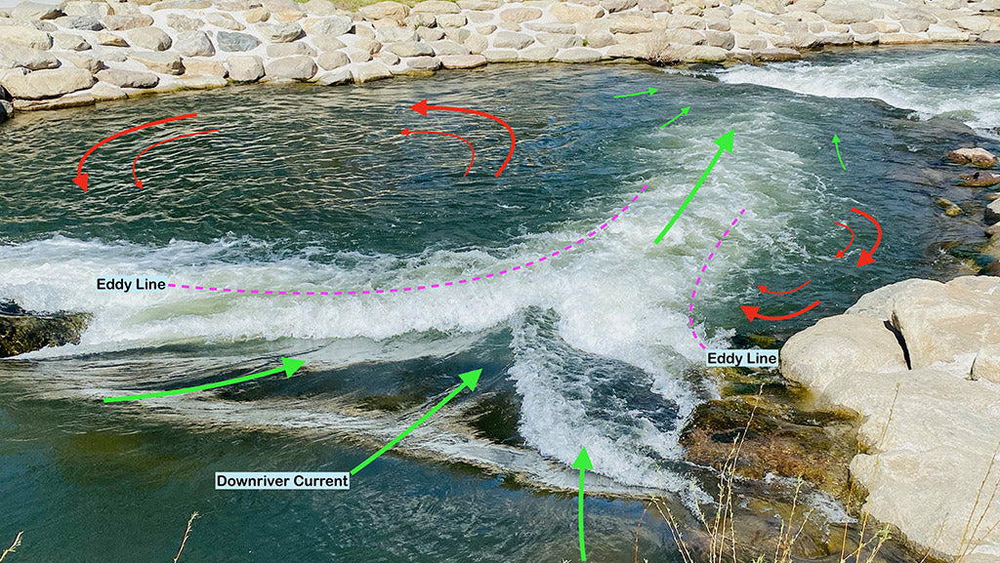
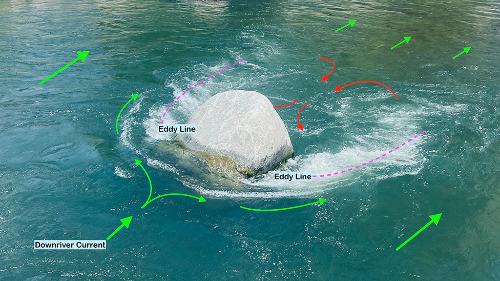

# Czytanie wody

## Poznajmy się z cofkami

Cofki to wspaniałe miejsca, dzięki którym w ogóle możemy pływać po rzekach. Czy wyobrażacie sobie pływanie bez cofek, tak na serio żadnych, żadnych cofek ? Bo ja nie.
Zwykle kojarzą nam się ze spokojnymi “basenikami”, w których można rozprostować nogi i zjeść batonika ale czy w każdej cofce byście tak zrobili ?

Zapraszam na serię pytań i odpowiedzi, która rozwieje te wątpliwości.

### Jak tworzą się cofki ?

Zwykle za przeszkodami np. za kamieniami, ostrogami, drzewami, mieliznami, odwojami , które powodują zmianę biegu wody (w uproszczeniu)

https://www.calipaddler.com/blogs/paddle-articles/understanding-eddy-currents-in-rivers
